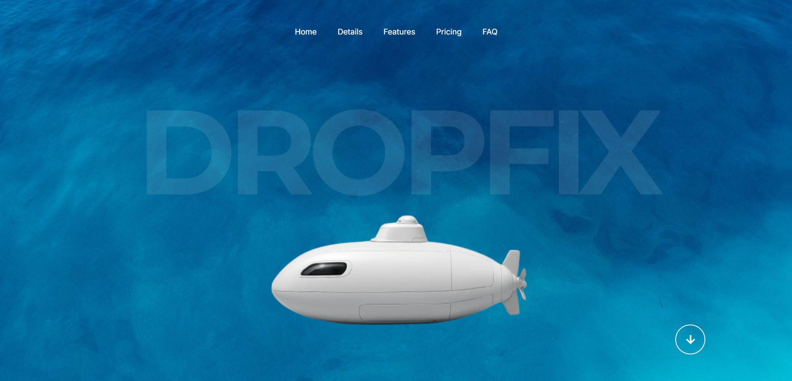
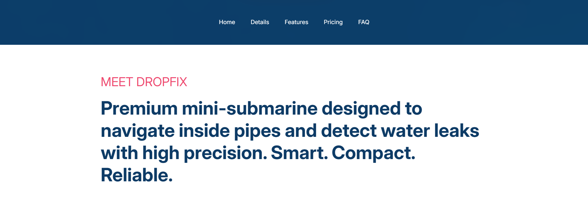
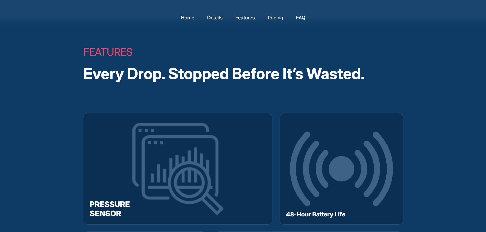
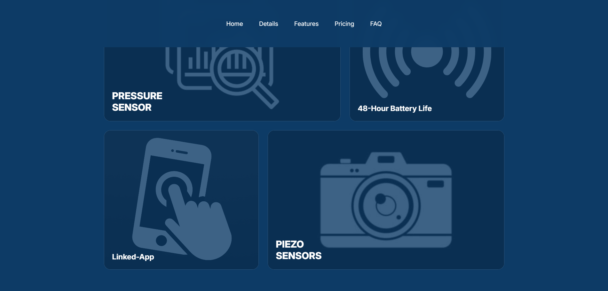

<h1 align="center">Dropfix : Website in HTML & CSS</h1>

A responsive one-page website that sells a product called DropFix by highlighting it's features and pricing.

**Note :** DropFix is not a real product.

## Table of content

- [Demo](#demo)
- [About The Project](#about-the-project)
  - [Home Page](#home-page)
  - [Product Overview](#product-overview)
  - [Features](#features)
  - [Mobile App](#mobile-app)
  - [FAQ](#faq)
  - [Pricing](#pricing)
- [Tech Stack](#tech-stack)
- [Author](#author)

## Demo

Link here --> [xtrawalo.github.io/DropFix](https://xtrawalo.github.io/DropFix)

## About The Project

### Home Page

It immediately showcases the product, with its name displayed in the background and a sea-themed design.

### Product Overview

A simple description of the product.

### Features

The product's features :
- Pressure sensor
- 48-Hour Battery Life
- Piezo Sensors
- Linked-App

### Mobile App

A button to download the app connected to Dropfix.

**Note :** There is no Mobile App.
### FAQ

Answers to the most frequently asked questions about DropFix.

### Pricing

The price of Dropfix and a button to purchase it.

## Tech Stack

- HTML & CSS
- Minimal JavaScript

## Author

Me: [xtrawalo](https://github.com/xtrawalo)
